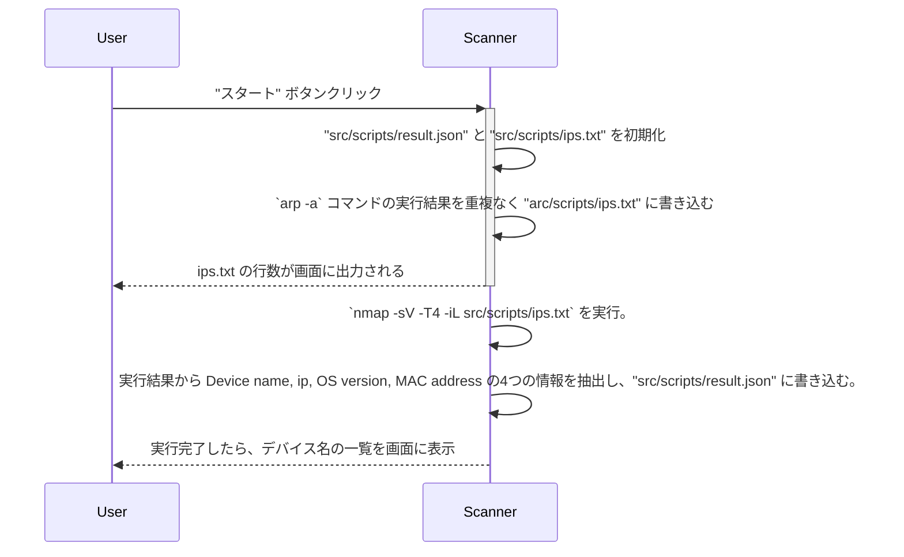
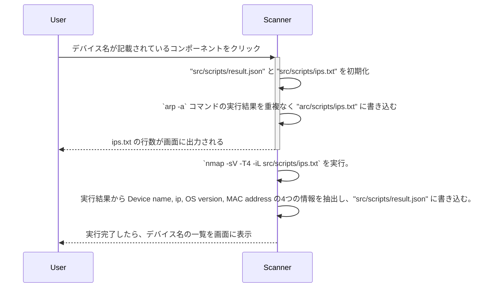

# Getting Started with Create React App

This project was bootstrapped with [Create React App](https://github.com/facebook/create-react-app).

## Available Scripts

In the project directory, you can run:

### `yarn start`

Runs the app in the development mode.\
Open [http://localhost:3000](http://localhost:3000) to view it in the browser.

The page will reload if you make edits.\
You will also see any lint errors in the console.

### `yarn test`

Launches the test runner in the interactive watch mode.\
See the section about [running tests](https://facebook.github.io/create-react-app/docs/running-tests) for more information.

### `yarn build`

Builds the app for production to the `build` folder.\
It correctly bundles React in production mode and optimizes the build for the best performance.

The build is minified and the filenames include the hashes.\
Your app is ready to be deployed!

See the section about [deployment](https://facebook.github.io/create-react-app/docs/deployment) for more information.

### `yarn eject`

**Note: this is a one-way operation. Once you `eject`, you can’t go back!**

If you aren’t satisfied with the build tool and configuration choices, you can `eject` at any time. This command will remove the single build dependency from your project.

Instead, it will copy all the configuration files and the transitive dependencies (webpack, Babel, ESLint, etc) right into your project so you have full control over them. All of the commands except `eject` will still work, but they will point to the copied scripts so you can tweak them. At this point you’re on your own.

You don’t have to ever use `eject`. The curated feature set is suitable for small and middle deployments, and you shouldn’t feel obligated to use this feature. However we understand that this tool wouldn’t be useful if you couldn’t customize it when you are ready for it.

## Learn More

You can learn more in the [Create React App documentation](https://facebook.github.io/create-react-app/docs/getting-started).

To learn React, check out the [React documentation](https://reactjs.org/).

## シーケンス図
### 最初の実行


### デバイス詳細の表示


## 事前準備
### Nmap 実行
1. `yarn start` 実行し、アプリケーションを起動する。起動が完了したことを確認後、以下のコマンドを実行。その際、パスワードを求められする。デバイスのロックを解除するときと同じパスコードを入力し、エンターキーを押下。(入力中の値は見えないが入力できている)
```
sudo nmap -O -T4 -iL src/scripts/results/ips.txt -oX src/scripts/results/results_nmap_O.xml
```

:::note info
nmap のリファレンスより、[法的通知事項](https://nmap.org/man/ja/man-legal.html)を確認すると ｢独自開発の実行可能インストーラに統合/組込/集約する｣ ことは派生著作物に該当するとされている。有料契約するか、問い合わせることで派生著作物の確認をしてもらえるとのことだが、本アプリケーションでは事前準備ということで、アプリケーションに組み込まずに分けて実行した。上記のコマンド自体は nmap に用意されているオプションを指定しているだけである。
:::

2. src/scripts/results/results_nmap_O_{i}.json の情報を元に、アプリで利用するマスターデータファイルの src/scripts/results/result.json に追記していく以下のファイルを実行
``` zsh
./src/scripts/edit_result.sh
ts-node src/scripts/extract_and_clean_data.ts
```

3. ブラウザに戻り、｢スタート｣ ボタンを押下してアプリケーションを実行し、結果を確認する。

## 備考
本アプリケーションは表示形式をわかりやすくする目的でAppleのロゴを引用していますが、本アプリケーションは、独立した出版物であり、Apple Inc.が認定、後援、その他承認したものではありません。